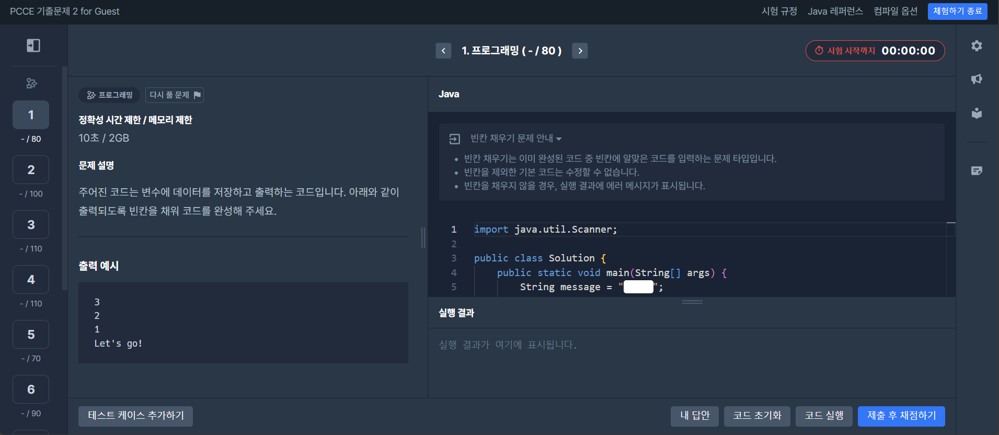

# hanhwabootcamp_15th_pcce_study
> PCCE 스터디를 위해 생성한 저장소

## 참고 사항

* 우측 상단 메뉴에서 [Java 레퍼런스](https://devdocs.programmers.co.kr/openjdk~11/) 제공됨

<!--물론 시간 내에 풀려면 안 보고 풀어야-->

## 샘플문제 1
* PCCE 기출문제 11-20번으로 구성
* 배점 모두 동일함(각 100점)

## 샘플문제 2
* PCCE 기출문제 1-10번으로 구성
* 배점 문제마다 각각 다름
    * 순서대로 80, 100, 110, 110, 70, 90, 80, 90, 100, 170